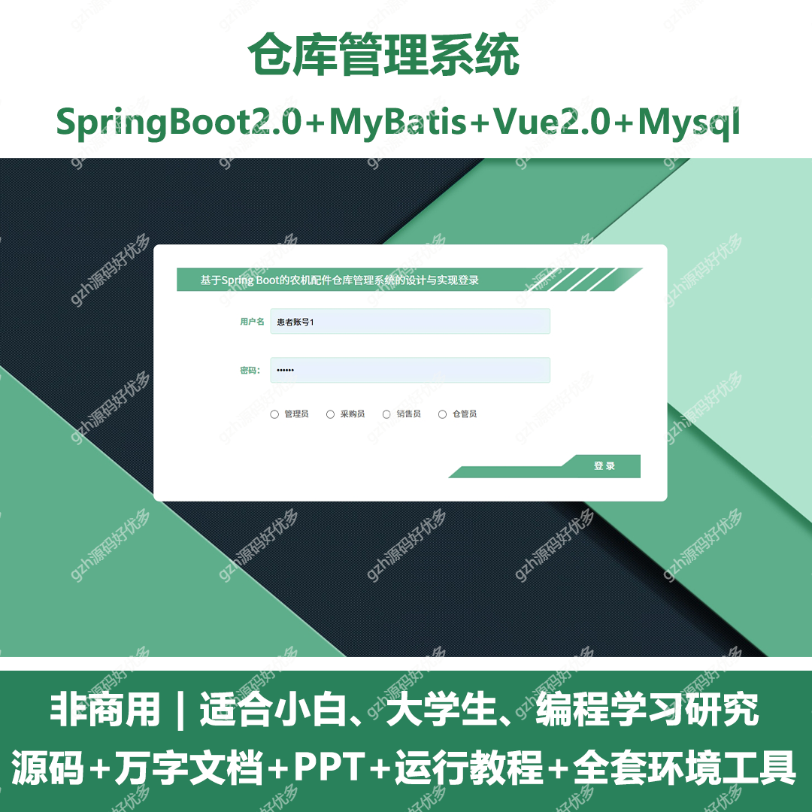
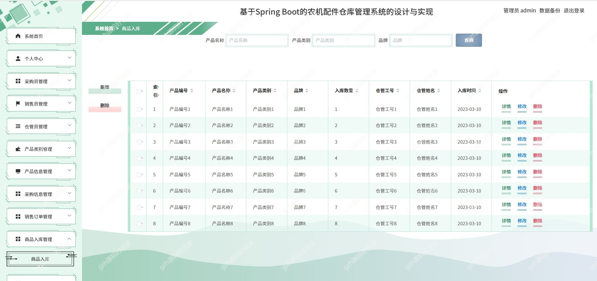
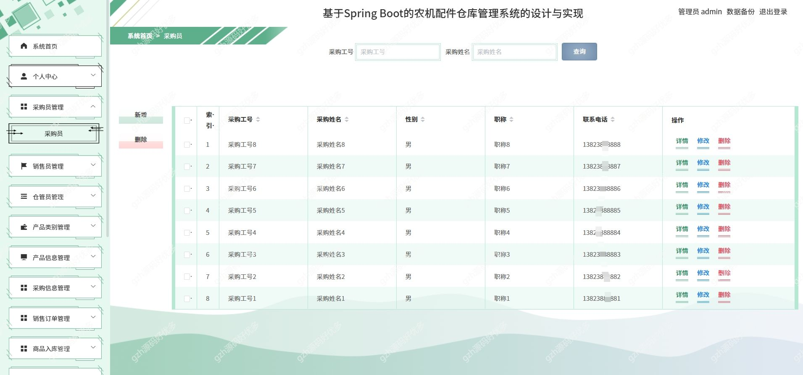
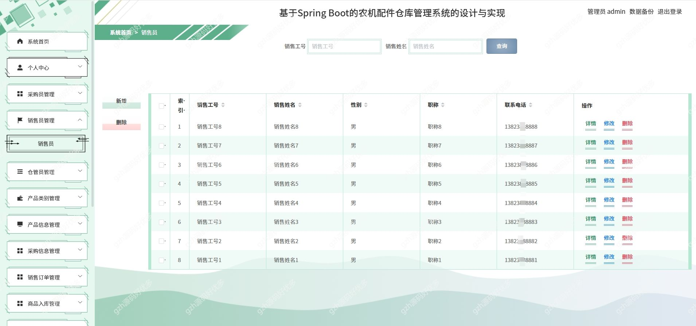
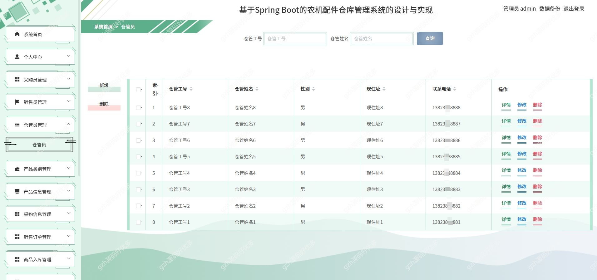
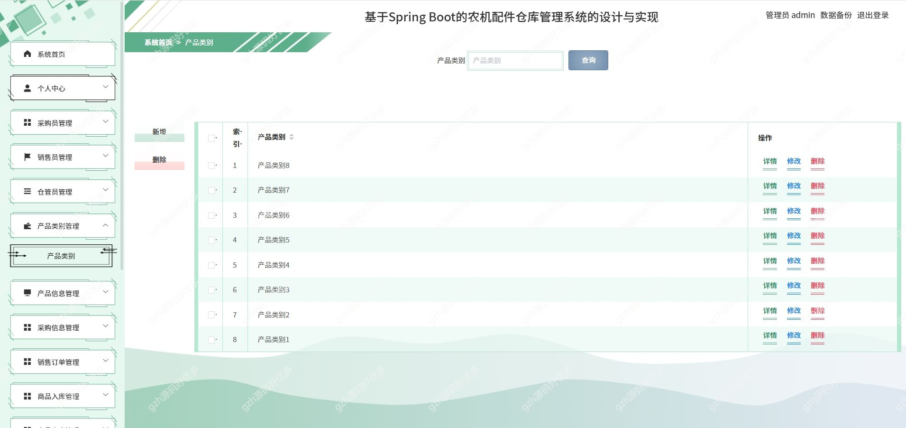
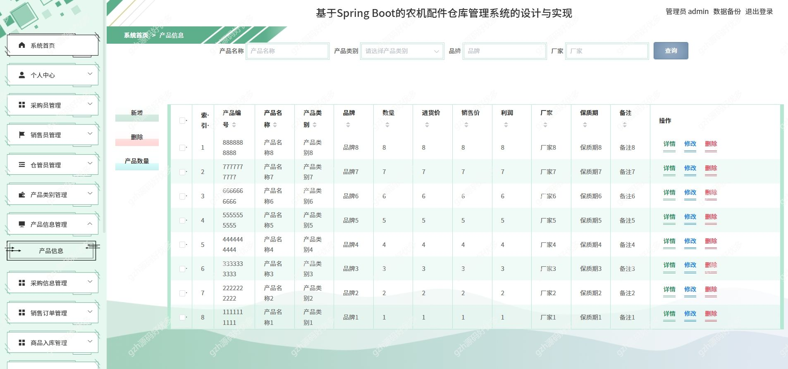
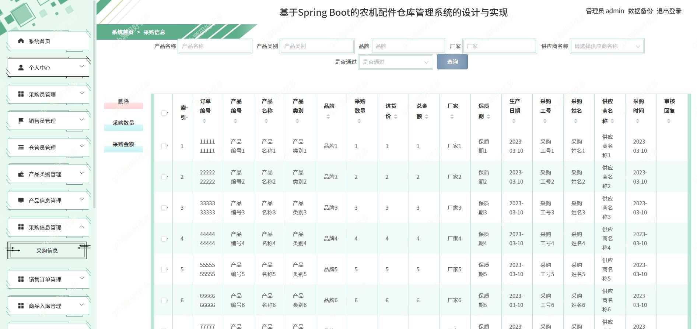
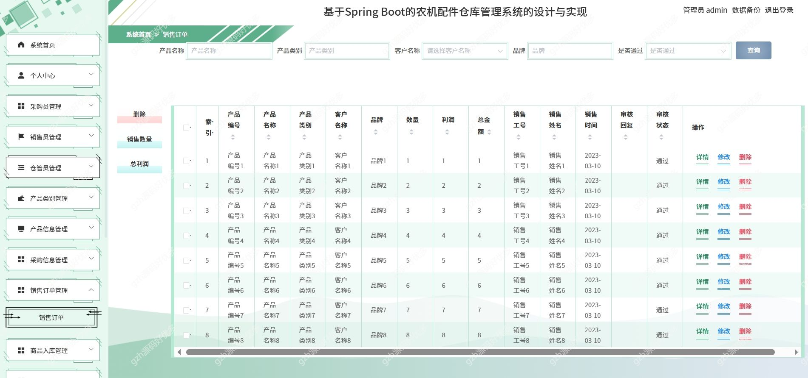

# springbootA328
springbootA328农机配件仓库管理系统
 
## 查看主页获取源码

### 一、关键词

仓库，仓储，配件管理系统
### 二、作品包含
源码+数据库+万字设计文档+PPT+全套环境和工具资源+本地部署教程

### 三、项目技术
前端技术：Html、Css、Js、Vue2.0、Element-ui 
后端技术：Java、SpringBoot2.0、MyBatis

### 四、运行环境（以下版本亲测，其他版本兼容性请自行测试）
开发工具：IDEA/eclipse  + VSCODE
数据库：MySQL5.7

数据库管理工具：Navicat10以上版本

环境配置软件： JDK1.8 + Maven3.6.3

前端Nodejs：14

浏览器：谷歌浏览器

### 五、项目介绍
项目编号：springbootA328

农机配件仓库管理系统的目的是让使用者可以更方便的将人、设备和场景更立体的连接在一起。能让用户以更科幻的方式使用产品，体验高科技时代带给人们的方便，同时也能让用户体会到与以往常规产品不同的体验风格。

这就意味着农机配件仓库管理系统的设计可以比其他系统更为出色的能力，可以更高效的完成最新的产品信息及商品的采购、入库、出库、供应商等功能。

### 六、运行截图

